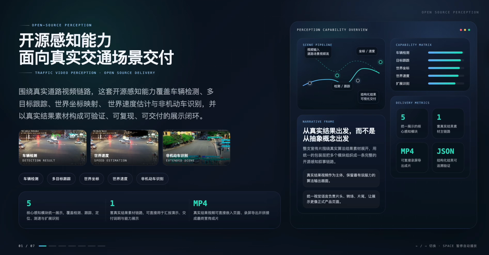
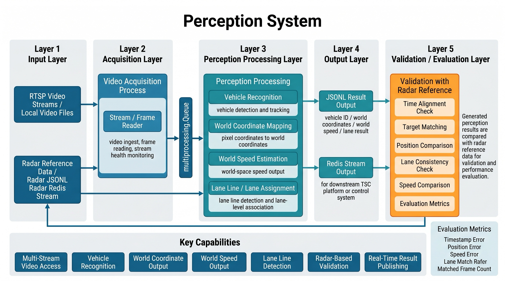

<div align="right">

[English](README.md) | [**中文**](README_ZH.md)

</div>

<div align="center">


[](#许可证)
[](https://www.python.org/)
[]()
[](https://github.com/OpenHelix-Team)
[](https://huggingface.co/)
[](#社交媒体)

</div>

### OpenTraffic 感知系统

面向城市交叉口的开源交通感知引擎，服务于 Perception-Driven TSC 场景。系统支持多路视频接入、车辆识别、世界坐标输出、世界速度估计、车道级结果生成，以及基于雷达参考数据的验证评测。

## Demo Video
[](videos/perception_raw.mp4)

## Framework



> **论文：** https://arxiv.org/abs/XXXX.XXXXX  
> **Hugging Face：** https://huggingface.co/  
> **GitHub：** https://github.com/OpenHelix-Team  
> **社交媒体：** X / 微信 / GitHub Discussions

## 最新动态

- **[2026/05/27]** 按统一英文主页风格重构感知 README，并补齐中文切换页。
- **[2026/05/15]** 发布感知系统初始版本，支持交叉口视频到结构化交通状态结果生成。

## 待办事项

- [x] 车辆识别流水线
- [x] 世界坐标输出
- [x] 世界速度输出
- [x] 车道级结构化结果
- [x] Redis Stream 发布
- [x] 雷达参考验证流程
- [ ] 增加更多功能-期待v2
- [ ] 发布公开预训练权重
- [ ] 支持更多交叉口模板
- [ ] 增加可视化看板
- [ ] 发布论文与基准页面

## 目录

- [框架图](#框架图)
- [待办事项](#待办事项)
- [目录结构](#目录结构)
- [快速开始](#快速开始)
- [配置说明](#配置说明)
- [功能介绍](#功能介绍)
- [性能指标](#性能指标)
- [论文](#论文)
- [Hugging Face](#hugging-face)
- [社交媒体](#社交媒体)
- [引用](#引用)
- [许可证](#许可证)
- [最新动态](#最新动态)


## 框架图

当前仓库展示使用的系统级框架图如下：

## 目录结构

```text
opentraffic-perception-engine-main/
├── README.md
├── README_ZH.md
├── figure/
│   ├── LOGO.png
│   ├── LOGO2x.png
│   └── Framework.png
└── opentraffic-TIR/
    ├── drivers/
    ├── recognizer/
    ├── input/
    ├── reference_radar/
    ├── redis-7.4.0/
    ├── run_local.sh
    ├── stop_local.sh
    └── requirements.txt
```

## 快速开始

### 环境要求

- 操作系统：`Linux x86_64`
- Python：`3.13+`
- NVIDIA Driver：`>= 560`
- CUDA 运行时：`推荐用于打包 GPU 部署`

### 安装

```bash
git clone <your-repository-url>
cd opentraffic-perception-engine-main/opentraffic-TIR
```

如果使用源码方式：

```bash
pip install -r requirements.txt
```

如果使用打包交付环境：

```bash
bash run_local.sh
```

### 运行

1. 准备 RTSP 视频源或本地视频文件。
2. 准备本地 Redis。
3. 配置 `drivers/config.json`。
4. 启动系统：

```bash
bash run_local.sh
```

5. 退出时输入：

```bash
q
```

## 配置说明

编辑 `opentraffic-TIR/drivers/config.json`。

### 核心配置字段

| 字段 | 说明 |
|---|---|
| `intersection.id` | 路口标识 |
| `intersection.cameras[].id` | 摄像头标识 |
| `intersection.cameras[].rtsp_url` | RTSP 地址或本地视频路径 |
| `intersection.cameras[].window` | 有效图像窗口 |
| `jsonlOutputDir` | JSONL 输出目录 |
| `radarReferenceJsonl` | 用于验证的雷达参考文件 |
| `vehicleMatchMaxDist` | 验证时的最大匹配距离 |
| `localRedisConfig.host` | Redis 主机地址 |
| `localRedisConfig.port` | Redis 端口 |

### 配置示例

```json
{
  "intersection": {
    "id": "HHL_QHDD",
    "cameras": [
      {
        "id": "HHL_QHDD_S",
        "rtsp_url": "./input/45_0429.mp4",
        "window": [0, 0, 1920, 1080],
        "H": [[...], [...], [...]],
        "H_inv": [[...], [...], [...]]
      }
    ]
  },
  "jsonlOutputDir": "./control_group_fullspeed_jsonl",
  "radarReferenceJsonl": "./reference_radar/HHL_QHDD_S/HHL_QHDD_S_shard_00000.jsonl",
  "vehicleMatchMaxDist": 10.0,
  "localRedisConfig": {
    "host": "127.0.0.1",
    "port": 6379
  }
}
```

## 功能介绍

### 1. 车辆识别

- 支持交叉口视频中的车辆检测与多目标跟踪。
- 兼容 RTSP 视频流与本地视频文件。
- 生成可用于下游交通状态输出的结构化目标 ID。

### 2. 世界坐标输出

- 将图像空间目标投影到世界坐标系。
- 使用标定后的单应矩阵进行像素到世界坐标映射。
- 输出适用于下游集成的雷达风格坐标结果。

### 3. 世界速度估计

- 在世界坐标系下估计目标速度。
- 为每个跟踪车辆输出结构化速度字段。
- 可用于交通状态解释以及与雷达参考的速度对比验证。

### 4. 车道线检测与车道级输出

- 支持感知目标的车道级归属。
- 将车辆目标与车道语义进行关联。
- 生成适合控制系统消费的车道级结构化结果。

## 性能指标

全量速度 `JSONL` 对原始雷达 `JSONL` 的对比结果如下：

### 字段准确率对比表

| 字段 / 指标 | mean | median（p50） | p75 | p90 | 说明 |
|---|---:|---:|---:|---:|---|
| `timestamp_ms` 误差（ms） | `25.04` | `26.5` | `37` | `46` | 视频帧与最近雷达帧的时间差 |
| `vehicles[].center` 误差（m） | `2.5132` | `1.6251` | `3.1987` | `6.7021` | 匹配目标的空间位置误差 |
| `vehicles[].speed_scalar` 误差（m/s） | `1.6727` | `0.3176` | `1.7741` | `5.0061` | 匹配目标的速度标量误差 |

### 字段一致率

| 字段 | 和雷达对比方式 | 一致率 / 结果 |
|---|---|---:|
| `intersection_id` | 精确一致率 | `100%` |
| `camera_id` | 精确一致率 | `100%` |
| `coordinate_space` | 精确一致率 | `100%` |
| `timestamp_ms` | 200ms 内对齐率 | `100%` |
| `vehicles[].lane` | 与雷达精确一致率 | `100%` |


## 论文

- 题目：`OpenTraffic Perception System for Perception-Driven TSC`
- 状态：`准备中 / 待发布`
- 占位链接：`https://arxiv.org/abs/XXXX.XXXXX`

## Hugging Face

- 模型主页：`https://huggingface.co/`
- 计划发布内容：
  - 感知模型打包版本
  - 示例输出结果
  - 基准测试样例

## 社交媒体

- GitHub 组织：`https://github.com/OpenHelix-Team`
- X / Twitter：`待补充`
- 微信 / 社群：`待补充`


## 引用

如果本项目对你的工作有帮助，请引用：

```bibtex
@article{opentraffic_perception_2026,
  title   = {OpenTraffic Perception System for Perception-Driven TSC},
  author  = {OpenTraffic Team},
  journal = {arXiv preprint},
  year    = {2026}
}
```

## 许可证

本 README 按 Apache-2.0 风格发布模板整理，用于仓库主页展示统一性。

计划公开发布许可证：

```text
Apache License
Version 2.0, January 2004
http://www.apache.org/licenses/
```

仓库说明：

- 仓库最终以 Apache-2.0 对外发布，在根目录补充正式 `LICENSE` 文件。

---

<div align="center">
  英文主页优先，配套中文切换页，便于 GitHub 统一展示。
</div>
